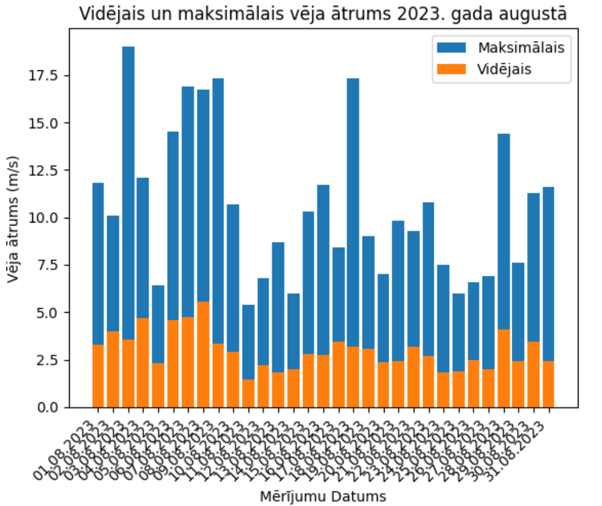
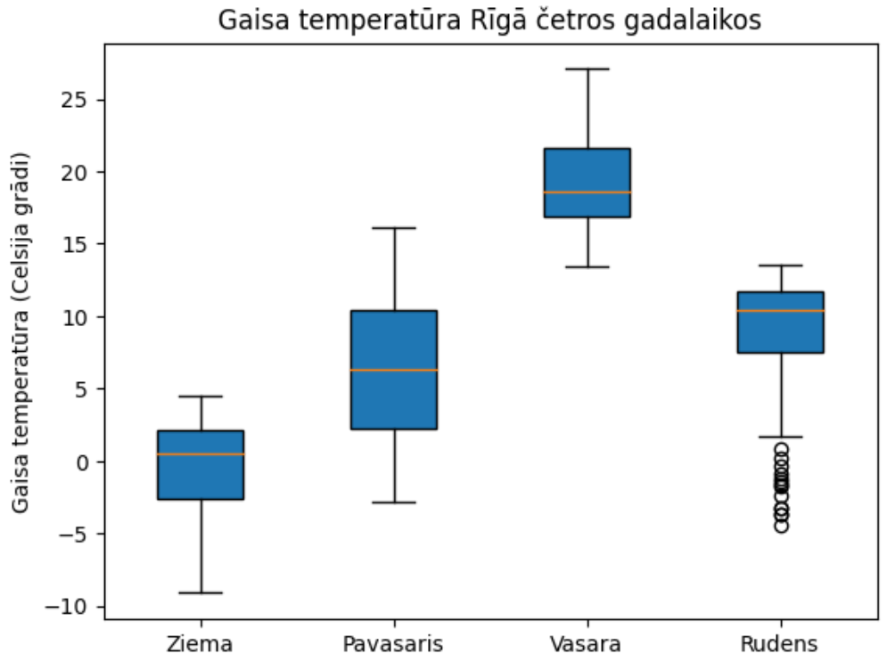

# Data analysis and visualization -- Homework 2

## Task 1 (4 points)

Show the graph ([`matplotlib`](https://pypi.org/project/matplotlib/) bar chart):
1. the average wind speed for each day in August (file [`vejaAtrumsFaktiskais.xlsx`](./data/vejaAtrumsFaktiskais.xlsx)).
2. the maximum gust wind speed for each day in August (file [`vejaAtrumsBrazmas.xlsx`](./data/vejaAtrumsBrazmas.xlsx)).

The graph must contain all the elements (explanations on the **axes**, **legend**, **caption**) shown in the result example:

## Task 2 (6 points)

Create a [`matplotlib`](https://pypi.org/project/matplotlib/) box plot that shows the daily average temperature statistics by season.
An example of the final result is shown below. The graph must contain all the elements shown in the example.

You can use the [`pandas`](https://pypi.org/project/pandas/) or [`numpy`](https://pypi.org/project/numpy/) functionality to aggregate the data.
Note that the statistical values are calculated by the box plot function, but you need to aggregate the average temperatures by day for the individual seasons.

For this exercise, assume that the winter months are December, January and February, the spring months are March to May, the summer months are June to August and the autumn months are September to November.

Air temperatures are available in the file [`gaisaTemperatura2022.xlsx`](./data/gaisaTemperatura2022.xlsx)

